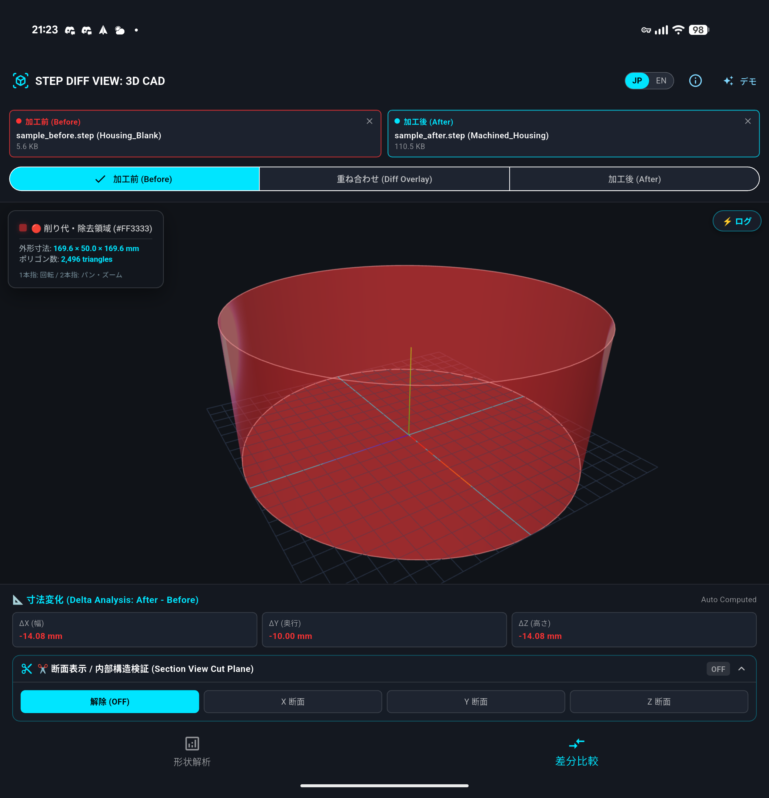
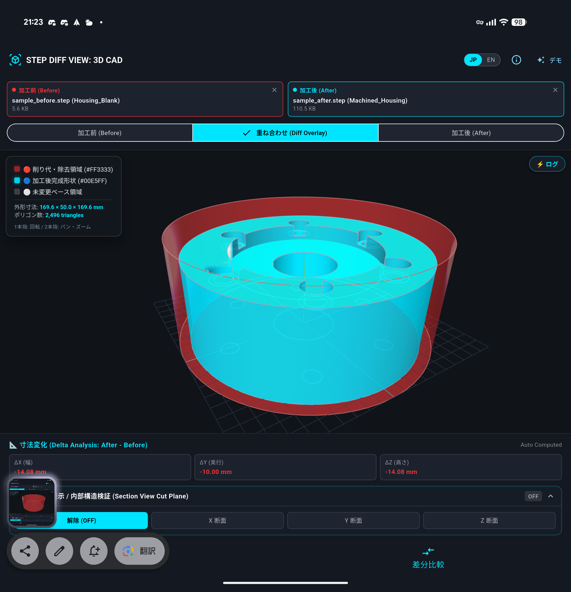
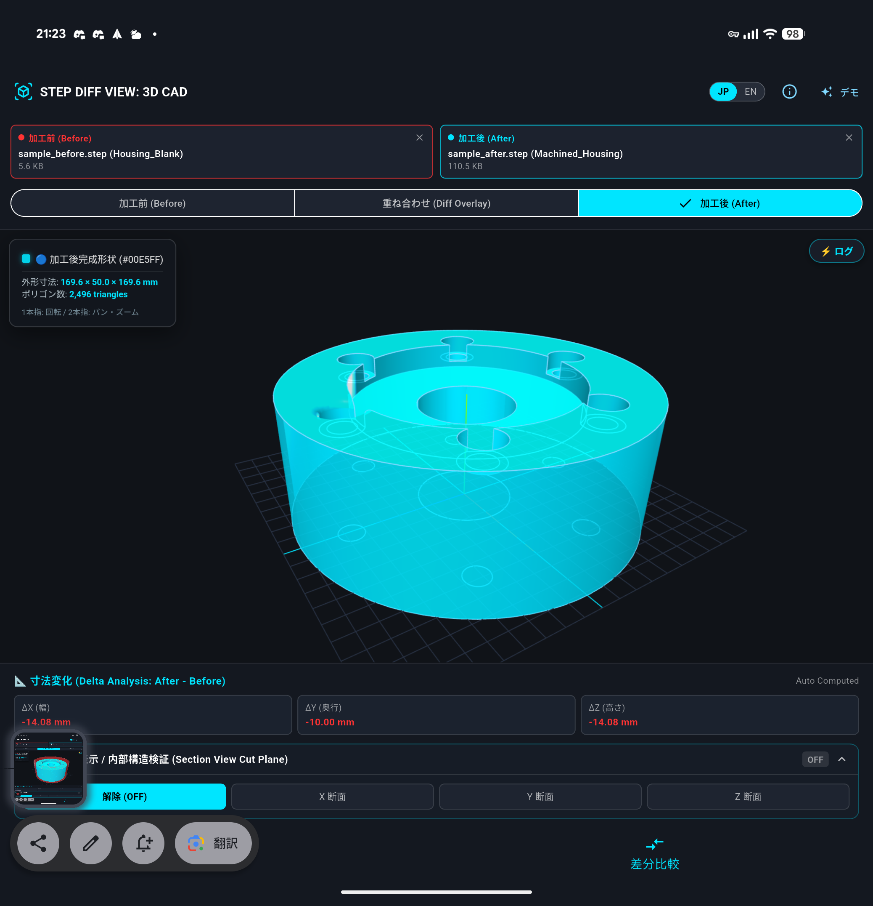
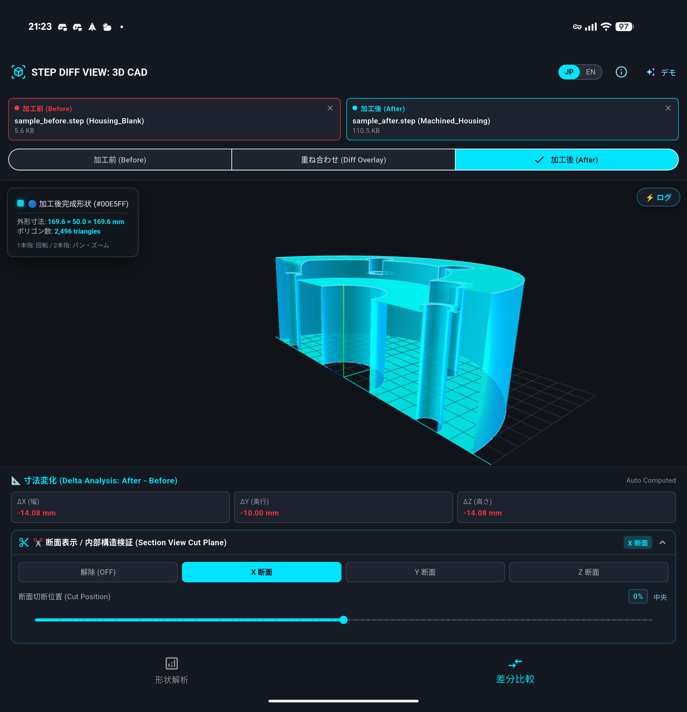
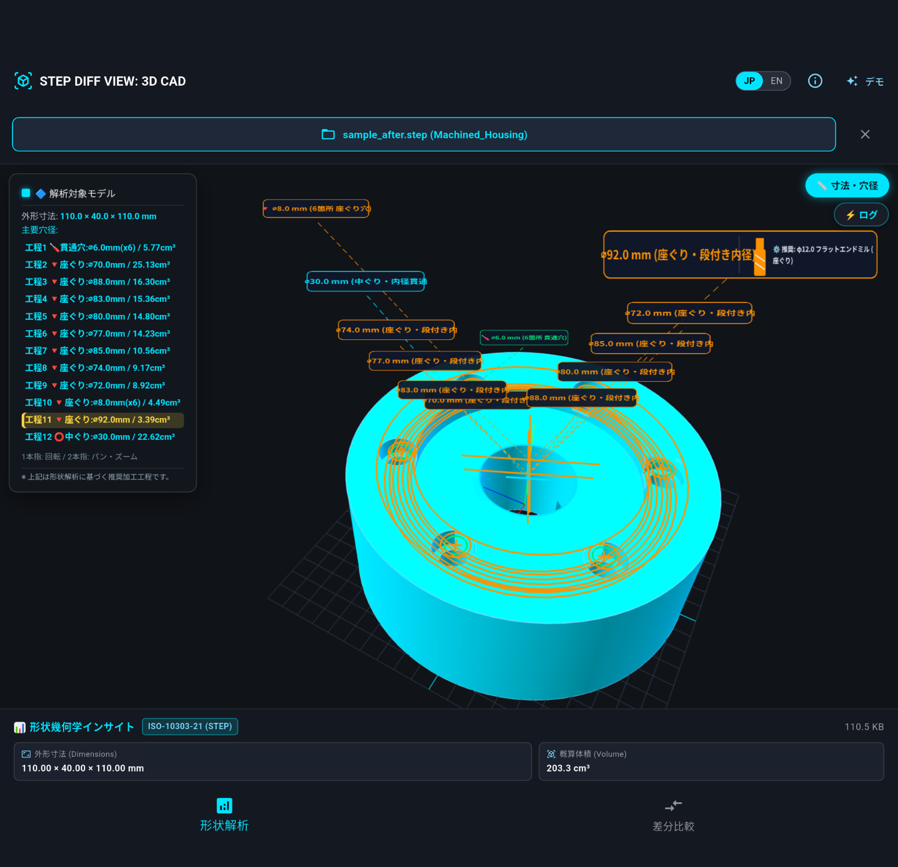
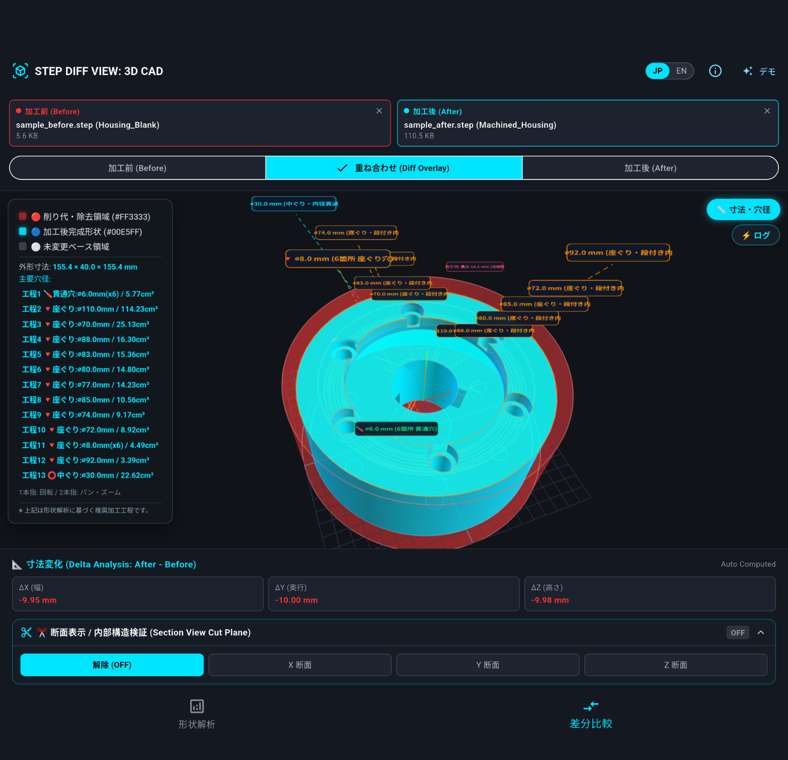

## [Beta Release] STEP DIFF VIEW: Lightweight 3D CAD Inspection Tool for Android

### What is STEP DIFF VIEW?
STEP DIFF VIEW is a lightweight Android application designed to quickly load and compare two 3D CAD models (STEP format) right in the palm of your hand.
This tool is not built to replace heavy PC-based CAD software. 
Instead, it is crafted for those moments when you think:"I don't need to boot up my heavy desktop CAD software, but I want to quickly inspect geometric changes on-site."

### Key Features
The core functionality is deliberately kept simple and focused on a 3-mode workflow.

#### Before: 

Displays the original reference STEP model (e.g., blank or raw material).

#### Diff Overlay:

Superimposes both STEP models with color-coding (Red: Base/Before model, Blue: Finished/After model) to visually inspect geometric variations.

Note: Rather than computing exact, heavy boolean solid subtraction on-device, it overlays both geometries in a unified coordinate system to provide instant, intuitive visual verification.

#### After: 

Displays the final processed STEP model independently.The UI follows a natural timeline sequence: 
Before ➔ Diff Overlay ➔ After. 
You inspect the initial state, verify the differences, and examine the final result without a steep learning curve.

#### Split X Axis

### New: Shape Analysis and Suggested Machining Sequence

Shape Analysis displays the model dimensions, approximate volume, and principal hole diameters from a single STEP model.

- Identifies drilled, through/bored, and counterbored/stepped holes
- Suggests a hole-machining sequence from detected geometry, estimated depth, removal volume, and feature dependencies
- Shows a suggested tool for each operation
- Links the 3D hole labels with the operation list in the upper-left HUD
- Supports section views along the X, Y, and Z axes

The suggested sequence and tools are reference information inferred from the STEP geometry. They do not account for material, machine, workholding, cutting conditions, or CAM toolpaths. External turning, facing, and outside-diameter finishing tools are not currently included.

### Using Shape Analysis

1. Select **Shape Analysis** at the top of the screen.
2. Choose a STEP file or load the demo data.
3. Tap **Dimensions / Hole Diameters** to show detected-hole labels on the model.
4. Tap either a 3D label or an operation in the upper-left list. The corresponding item is highlighted, and the enlarged label shows the suggested tool and a simple tool illustration.
5. To inspect a section, select a cutting axis and adjust the cutting position.

Switching between Shape Analysis and Diff Comparison resets the destination workspace to an unloaded state, preventing a model from the other mode from remaining on screen.

### Using Diff Comparison

1. Select **Diff Comparison** at the top of the screen.
2. Choose the Before and After STEP files.
3. Switch between **Before**, **Diff Overlay**, and **After**.
4. Select a cutting axis and position when a section view is needed.

Diff Comparison is a visual mesh overlay with bounding-dimension differences; it does not calculate an exact Boolean solid subtraction.

### Strict Alignment & Coordinate
IntegrityA critical design choice in STEP DIFF VIEW is how model coordinates are handled.
Many 3D viewers automatically re-center or auto-scale loaded models for aesthetic purposes. 
However, doing so ruins the relative position when comparing two manufacturing models. 

STEP DIFF VIEW strictly preserves the original CAD coordinate system and origin $(0,0,0)$, prioritizing engineering consistency over visual fluff.

### Beta Release & Feedback Request

This project is currently in early Beta. The main objective of this release is to test real-world STEP files directly in field environments.A built-in demo model is included, so you can test the 3D rendering and Diff Overlay functionality immediately upon installation without uploading your own files.

Target OS: Android 16 (Tested on Pixel 10 Pro Fold)  
Supported Formats: STEP (.step / .stp)  
Price: Free (Beta)   

If you test your own STEP models and have any feedback—such as file compatibility, rendering speed, or feature suggestions for field use—we would love to hear your thoughts on GitHub Issues!

### Disclaimer
STEP DIFF VIEW is a beta tool designed solely for visual verification of 3D data. 
It does not guarantee full accuracy or geometric precision. For critical manufacturing, machining, or engineering decisions, please always verify using certified CAD/CAM software and proper physical measurement tools. 
The developer assumes no liability for any losses resulting from the use of this software.
